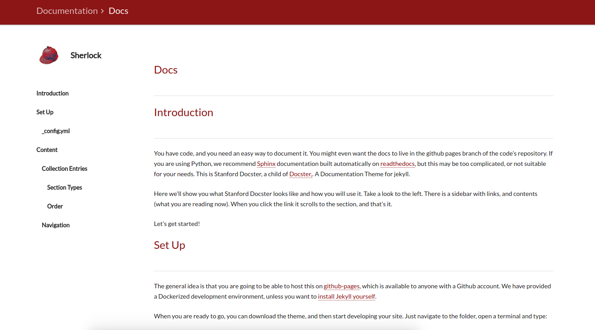

# RedDocs Researcher Docs

Welcome to the RedDocs template for researcher documentation! This is a [Jekyll](https://jekyllrb.com/docs/installation/) site, meaning that it is incredibly easy to contribute to. How easy?

- adding a news item means adding a markdown document to the [_posts/news](_posts/news) folder
- the core docs, which are rendered automatically along with navigation, are also markdown files in the [_docs](_docs) folder
- the site renders automatically on a push to the `gh-pages` branch of the repo, no additional building or continuous integration is necessary.

## QuickStart
Clone, make changes to files in [_docs](_docs), and push a PR to the `gh-pages` branch of this repo to be reviewed. More specifically:

      git clone https://github.com/stanford-rc/sherlock-docs
      cd sherlock-docs

1. Option 1: Docker

Download [docker](https://docs.docker.com/engine/installation/), download the site repository to a folder, and run a container:

      docker run --label=jekyll --volume=$(pwd):/srv/jekyll -it -p 127.0.0.1:4000:4000 jekyll/jekyll

Then go to `127.0.0.1:4000/template-jekyll-docs/` in your browser to see the site! Make changes, add the files to your github folder, preview and go! We can even easily add continuous integration to preview the site so others don't have to build locally.

2. Option 2: Run Locally

Install [Jekyll](https://jekyllrb.com/docs/installation/) and then run with:

      jekyll serve

### About Pages
A page is rendered with the template that has a sidebar, the one that looks like this:

Any page that you add, meaning an `html` or `markdown` file in the [pages](pages) folder will have the docs sidebar if you add the following to the front-end matter:

      sidebar: true

When left undefined (desired for pages like news, 404, etc), this sidebar will not include the docs.

### How do the docs work?
Check out the [demo](https://researchapps.github.io/template-jekyll-docs/docs) to learn about how the folder of [_docs](_docs) is rendered automatically. 

### Need help?
Check out the [demo](https://researchapps.github.io/template-jekyll-docs), and for feature requests please submit an [issue](https://github.com/researchapps/template-jekyll-docs/issues). This is a work in progress, and much change is expected. Specifically:

- What functions or content formatting would you like to see for examples?
- What third party integrations would be useful?
- What can we describe better for setting up or changing content?

### Special Thanks
Huge props to [mkdocs-material](https://github.com/squidfunk/mkdocs-material) by squidfunk the base material design template that we converted to Jekyll, and to @killian for getting us started with the hugo version!
